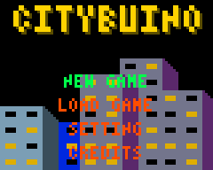
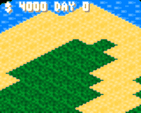
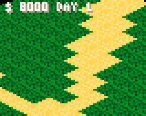
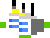
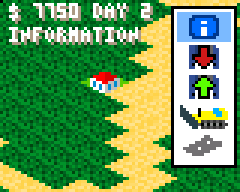
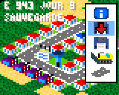
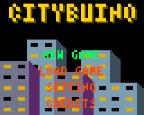
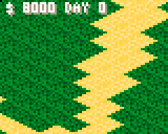

FRANCAIS / FRENCH

# CITYBUINO #
**Un jeu vidéo pour la Gamebuino META (https://gamebuino.com/fr)**

**A video game for Gamebuino META (https://gamebuino.com/fr)**

**Tags :** #CITY #SIMCITY #CONSTRUCT #pixelart #arduino #cplusplus #gamebuino

**Author :** Laurent MEURILLON

**Release V0.70 :** 03/01/2020

**Release V0.80 :** 18/01/2020

**Release V0.90 :** 14/03/2020

Pour l'instant, le jeu est en développement, il peut y avoir quelques bugs !

-----------------

## Description du jeu ##
-----------------
Un jeu de simulation de gestion d'une ville en vue isométrique

Le but est de gérer et d'organiser votre ville sans perdre d'argent

Pour celà, il faudra vous rendre dans les informations de la ville pour gérer vos finances

Dès que la somme est négative, vous avez perdu la partie !..

Vous avez la possibilité de sauvegarder votre ville pour la reprendre plus tard.

-----------------

## <u>MENU PRINCIPAL</u> du jeu ##

-----------------

Le jeu est par défaut en anglais mais vous pouvez changer la langue dans les options 
(*le jeu sauvegardera automatiquement les paramètres de configuration*).

- **NOUVEAU JEU :** Démarrer une nouvelle partie
- **CONTINUER JEU :** Continuer la ville que vous avez sauvegardée
- **OPTIONS :** Modifier la langue du jeu ( paramètre sauvegardé )
- **CREDITS :** LOGO PERSO :-)

-----------------

## <u>LES COMMANDES</u> du jeu ##

-----------------

### <u>LES MOUVEMENTS</u> sur la carte :  ###

- **FLECHE DROITE GAUCHE BAS HAUT :** Permet de naviguer dans la carte

En <u>haut à gauche</u> est indiqué la <u>somme</u> que vous possedez ainsi
que le <u>nombre de jour</u> d'existance de votre ville *( changement tous les 60 secondes )*.

### <u>LE MENU</u> dans le jeu : ###

- **BOUTON MENU :** Fait apparaitre ou disparaitre le menu de droite
- **BOUTON A :**    Se déplacer de haut en bas dans le menu  
- **BOUTON B :**    Selectionnner une action ou une construction

Ce menu permet de sélectionner des constructions ou des actions.

En dessous de l'affichage de vos finances est indiqué une information sur l'icone et 
aussi son coût.

Si il n'y a pas de coût, c'est juste une action (info, sauvegarde etc.)

-----------------
## LES CONSTRUCTIONS ##

-----------------
Les constructions ont tous besoin au minimum
 
 1. une route d'accès
 2. de l'électricité (sauf la centrale)
 3. de l'eau (sauf le château d'eau)
 
### Les routes : ###

 : Tracez des routes à côté de vos constructions

 : cet erreur apparait si la construction ne possèdent aucune route autour d'elle.

Les virages, les intersections et l'orientation des voies sont gérés automatiquement par le jeu.

### Les logements : ###

 : La maison avec une toiture rouge est le premier niveau d'habitation

 :Vous pouvez faire evoluer les logements en utilisation le dernier icône du menu 

### La centrale électrique : ###

 : La centrale électrique est indispensable pour alimenter les constructions en électricité

 : cet erreur apparait sur les constructions en manque d'électricité

La centale électrique permet d'alimenter les constructions sur une supercifie rectangulaire de 10 par 10.

### Le château : ###

 : Le château d'eau permet d'alimenter en eau les constructions.

 : cet erreur apparait sur les constructions en manque d'électricité

### L'usine : ###

 : Elle permet de créer de l'emploi.

 : cet erreur apparait sur les logements en manque de travail.

-----------------

## LES ACTIONS ##

-----------------
### Les informations sur votre ville : ###

 En cliquant sur le premier icone du menu, une fenêtre apparait avec 4 indicateurs sur l'état de votre ville.

 1. **Les citoyens :** Le nombre de **citoyen** dans la ville et le nombre maxi de **citoyen**
 2. **Le debit :** Le cout d'entretien des installations de la ville est de **5 %** de la valeur
    d'achat
    - *Route = **- 2***
    - *Centrale élèctrique = **- 40***
    - *Le château d'eau = **- 25***
 3. **Le crédit :** Le gain avec les taxes sur les habitants est de **20 %** de la valeur d'achat
    - *Maison rouge = **+ 50***
    - *Maison bleue = **+ 100***
    - *Immeuble niveau 1 = **+ 200***
 4. **Le travail :** Correspond simplement au nombre d'usine.
    - *Usine = **+ 20 emplois***

### La sauvegarde de votre ville : ###

 En cliquant sur le second icone du menu, une fenêtre apparait pour vous permettre de sauvegarder votre ville.

<u>**!! ATTENTION !! :**</u> L'ancienne sauvegarde est automatiquement écrasée.

### La chargement de votre ville : ###

*Chargement de la sauvegarde à partir du menu principale*

*Chargement de la sauvegarde à partir du jeu avec le menu déroulant de droite*

 Le troisième icone, permet de recharger votre ville.

<u>**!! ATTENTION !! :**</u> La ville actuelle sera définitivement perdue. il est possible de charger la sauvegarde directement à partir du menu principal.
