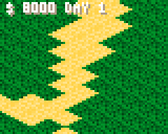

FRANCAIS / FRENCH

# CITYBUINO #
**Un jeu vidéo pour la Gamebuino META (https://gamebuino.com/fr)**

**A video game for Gamebuino META (https://gamebuino.com/fr)**

**Tags :** #CITY #SIMCITY #CONSTRUCT #pixelart #arduino #cplusplus #gamebuino

**Author :** Laurent MEURILLON

**Release V0.70 :** 03/01/2020

**Release V0.80 :** 18/01/2020

**Release V0.90 :** 14/03/2020

Pour l'instant, le jeu est en développement, il peut y avoir quelques bugs !

-----------------

## Description du jeu ##
-----------------
Un jeu de simulation de gestion d'une ville en vue isométrique.

Le but est de gérer et d'organiser votre ville sans perdre d'argent.

Pour celà, il faudra vous rendre dans les informations de la ville ( icône :  ) pour gérer vos finances.

Dès que la somme est négative, vous avez perdu la partie !

Vous avez la possibilité de sauvegarder votre ville pour la reprendre plus tard.

-----------------

## <u>MENU PRINCIPAL</u> du jeu ##

-----------------

Le jeu est par défaut en anglais mais vous pouvez changer la langue dans les options 
(*le jeu sauvegardera automatiquement les paramètres de configuration*).

- **NOUVEAU JEU :** Démarrer une nouvelle partie.
- **CONTINUER JEU :** Continuer la ville que vous avez sauvegardée.
- **OPTIONS :** Modifier la langue du jeu (paramètre sauvegardé).
- **CREDITS :** LOGO PERSO :-)

-----------------

## <u>LES COMMANDES</u> du jeu ##

-----------------

### <u>LES MOUVEMENTS</u> sur la carte :  ###

- **FLECHE DROITE GAUCHE BAS HAUT :** Permet de naviguer dans la carte.

En <u>haut à gauche</u> est indiquée la <u>somme</u> que vous possédez ainsi
que le <u>nombre de jours</u> de votre ville *( changement toutes les 60 secondes )*.

### <u>LE MENU</u> dans le jeu : ###

- **BOUTON MENU :** Fait apparaitre ou disparaitre le menu de droite
- **BOUTON A :**    Permet de se déplacer de haut vers bas 
- **BOUTON B :**    Selectionnner une action ou une construction

Ce menu permet de sélectionner des constructions ou des actions pour agir sur votre ville.

En dessous de l'affichage de vos finances, est indiquée une information propre à l'icône du menu et 
aussi le prix des constructions.

Si il n'y a pas de prix, c'est juste une action (info, sauvegarde, etc.).

-----------------
## LES CONSTRUCTIONS ##

-----------------
Les constructions ont tous besoin au minimum :
 
 1. d'une <u>route</u> d'accès
 2. de l'<u>électricité</u> (sauf la centrale)
 3. de l'<u>eau</u> (sauf le château d'eau)
 4. du <u>travail</u> (seulement pour les habitations).

 
### Les routes : ###

 : Tracez des routes à côté de vos constructions.

 : Cette erreur apparait si la construction ne possède aucune route autour d'elle.

Les virages, les intersections et l'orientation des voies sont gérés automatiquement par le jeu (*il y a encore quelques sur certaines combinaisons*).

### Les logements : ###

 : La maison avec une toiture rouge est le premier niveau d'habitation.

 : Vous pouvez faire évoluer les logements en utilisant le dernier icône du menu. 

### La centrale électrique : ###

 : La centrale électrique est indispensable pour alimenter les constructions en électricité.

 : Cette erreur apparait sur les constructions en manque d'électricité.

La centrale électrique permet d'alimenter les constructions sur une emprise rectangulaire de 10 par 10.

### Le château : ###

 : Le château d'eau permet d'alimenter en eau les constructions.

 : Cette erreur apparait sur les constructions en manque d'eau.

Le château a une emprise identique à la centrale électrique.

### L'usine : ###

 : Elle permet la création de 20 emplois.

 : Cette erreur apparait sur les logements en manque de travail.

L'usine fournit des emplois aux citoyens sur une emprise rectangulaire de 20 par 20. 

-----------------

## LES ACTIONS ##

-----------------
### Les informations sur votre ville : ###

 En cliquant sur le premier icône du menu, une fenêtre apparait avec 4 indicateurs sur l'état de votre ville.

 1. **Les citoyens :** Le nombre de **citoyens** dans la ville et le nombre maxi de **citoyens**
 2. **Le débit :** Le coût d'entretien des installations de la ville est de **5 %** de la valeur
    d'achat.
    - *Route = **- 2***
    - *Centrale élèctrique = **- 40***
    - *Le château d'eau = **- 25***
 3. **Le crédit :** Il est égal à **20 %** de la valeur d'achat.
    - *Maison rouge = **+ 50***
    - *Maison bleue = **+ 100***
    - *Immeuble niveau 1 = **+ 200***
 4. **Le travail :** Correspond simplement au nombre d'usines sans travail.
    - *Usine = **+ 20 emplois***

### La sauvegarde de votre ville : ###

 En cliquant sur le second icône du menu, une fenêtre apparait pour vous permettre de sauvegarder votre ville.

<u>**!! ATTENTION !! :**</u> L'ancienne sauvegarde est automatiquement écrasée.

### La chargement de votre ville : ###

*Chargement de la sauvegarde à partir du menu principal*

*Chargement de la sauvegarde à partir du jeu avec le menu déroulant de droite*

 Le troisième icône permet de recharger votre ville.

<u>**!! ATTENTION !! :**</u> La ville actuelle sera définitivement perdue. Il est possible de charger la sauvegarde directement à partir du menu principal.
